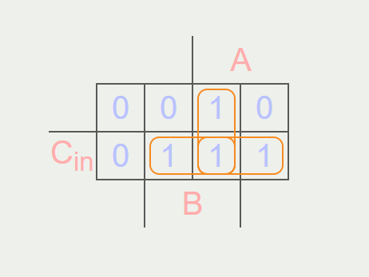
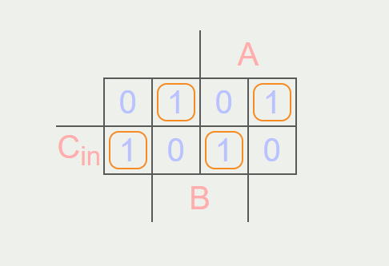

# Digital Systems Design 2

## Combinational Logic

### Implemetation of Arithmetic Functions

#### Binary Half Adder

We wish to design a circuit to add two single bit numbers $A$ and $B$. We start with the truth table:

| $A$ | $B$ | $C_{out}$ | $Sum$ |
|---|---|---|-----|
| 0 | 0 | 0 | 0 |
| 0 | 1 | 0 | 1 |
| 1 | 0 | 0 | 1 |
| 1 | 1 | 1 | 1 |

Synthesising the above truth table for the outputs $C_{out}$ and $Sum$ we get the following boolean expressions:

$$C_{out} = A.B$$

$$Sum = \overline{A}.B + A.\overline{B} = A \oplus B$$

The logic-circuit implemetation of the binary half adder is:

TODO: Add circuit

Or equivalently:

TODO: Add circuit

#### Full Adder

Full binary addition requires both an input carry $C_{in}$ and output carry $C_{out}$. The inputs $A$ and $B$ are 4-bits, but the result may require up to 5-bits to account for overflow. Once again we will start with the truth table:

| $A$ | $B$ | $C_{in}$ | $C_{out}$ | $Sum$ |
|-----|-----|----------|-----------|-------|
| 0 | 0 | 0 | 0 | 0 |
| 0 | 0 | 1 | 0 | 1 |
| 0 | 1 | 0 | 0 | 1 |
| 0 | 1 | 1 | 1 | 0 |
| 1 | 0 | 0 | 0 | 1 |
| 1 | 0 | 1 | 1 | 0 |
| 1 | 1 | 0 | 1 | 0 |
| 1 | 1 | 1 | 1 | 1 |

A simple way to synthesise this truth table into the correpoding (simplified) binary expressions utilises Karnaugh maps. The Karnaugh map for $C_{out}$ is:

    

$$ C_{out} = A.B + A.C_{in} + B.C_{in} $$

    

## Karnaugh Maps

TODO: Complete section
