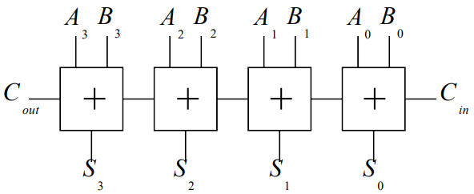

# Digital Systems Design 2

# Combinational Logic

## Implementation of Arithmetic Functions

### Binary Half-Adder

We wish to design a circuit to add two single bit numbers $A$ and $B$. We start with the truth table:

| $A$ | $B$ | $C_{out}$ | $Sum$ |
|---|---|---|-----|
| 0 | 0 | 0 | 0 |
| 0 | 1 | 0 | 1 |
| 1 | 0 | 0 | 1 |
| 1 | 1 | 1 | 1 |

Synthesizing the above truth table for the outputs $C_{out}$ and $Sum$ we get the following boolean expressions:

$$C_{out} = A.B$$

$$Sum = \overline{A}.B + A.\overline{B} = A \oplus B$$

The logic-circuit implementation of the binary half-adder is:

    

Or equivalently using an XOR gate:

    

### Binary Full-Adder

Full binary addition requires both an input carry $C_{in}$ and output carry $C_{out}$. Once again we will start with the truth table:

| $A$ | $B$ | $C_{in}$ | $C_{out}$ | $Sum$ |
|-----|-----|----------|-----------|-------|
| 0 | 0 | 0 | 0 | 0 |
| 0 | 0 | 1 | 0 | 1 |
| 0 | 1 | 0 | 0 | 1 |
| 0 | 1 | 1 | 1 | 0 |
| 1 | 0 | 0 | 0 | 1 |
| 1 | 0 | 1 | 1 | 0 |
| 1 | 1 | 0 | 1 | 0 |
| 1 | 1 | 1 | 1 | 1 |

A simple way to synthesize this truth table into the corresponding (simplified) binary expressions utilizes Karnaugh maps. The Karnaugh map for $C_{out}$ is:

    

$$C_{out} = A.B + A.C_{in} + B.C_{in}$$

    

$$Sum = \overline{A}.B.\overline{C_{in}} + A.\overline{B}.\overline{C_{in}} + \overline{A}.\overline{B}.C_{in} + A.B.C_{in} $$

It is not immediately obvious that the sum expression can be simplified further using XOR's. Proving the general formula for $\overline{A \oplus B}$:

$$\overline{A \oplus B} = \overline{A.\overline{B} + \overline{A}.B} = \left(\overline{A.\overline{B}} \right) . \left(\overline{\overline{A}.B} \right) = (\overline{A} + B).(A + \overline{B}) = \overline{A}.\overline{B} + A.B$$

The checkerboard Karnaugh map pattern hints at the XOR pattern, thus simplifying the expression for $Sum$:

$$Sum = \overline{A}.B.\overline{C_{in}} + A.\overline{B}.\overline{C_{in}} + \overline{A}.\overline{B}.C_{in} + A.B.C_{in}$$

$$= \overline{C_{in}}(\overline{A}.B + A.\overline{B}) + C_{in}(\overline{A}.\overline{B} + A.B)$$

$$ \overline{C_{in}}(A \oplus B) + C_{in}(\overline{A}.\overline{B} + A.B)$$

$$= \overline{C_{in}}(A \oplus B) + C_{in}(\overline{A \oplus B})$$

$$= A \oplus B \oplus C_{in}$$

The full-adder circuit implementation is:

    

Logically, a full-adder is an extension of the half-adder with a carry input $C_{in}$. The half adder outputs $C_{ha}=A.B$ and sum $Sum_{ha} = A \oplus B$. The full adder sumation is simply the XOR of half-adder sum output $Sum_{ha}$ with the input $C_{in}$:

$$Sum_{fa} = A \oplus B \oplus C_{in} = Sum_{ha} \oplus C_{in}$$

Similarly the full-adder carry output $C_{out}$ can be implemented using half-adders:

$$C_{out} = A.B + A.C_{in} + B.C_{in}$$

$$= A.B + (A + B).C_{in}$$

As the case where both $A$ and $B$ are true is covered by the first min-term in the expression the second term can be changed to XOR, without changing the expressions value:

$$C_{out} = A.B + (A + B).C_{in}$$

$$= A.B + (A \oplus B).C_{in}$$

$$= A.B + (Sum_{ha}).C_{in}$$

The full-adder can thus be implemented using half-adder's:

    

The full-adder circuit symbol is:

    

### Ripple Carry Adder

The full addition of $A_{3:0} = \{A_3, A_2, A_1, A_0 \}$ and $B_{3:0} = \{B_3, B_2, B_1, B_0 \}$ generating $S_{3:0} = \{S_3, S_2, S_1, S_0 \}$ can be implemented using consecutive full-adder's:

    

The Sum outputs $S_{3:0}$ are generated as the carry ripples through the chain of adders. 

#### Ripple Carry Adder Delay

The delay time depends on the number of logic states that must be traversed by the circuit. This time is dependant on the applied input signals $A_{n-1:0}$ and $B_{n-1:0}$, as the number of rippled states changes.

#### Ripple Carry Adder Critical Path Delay
Critical Path: The worst case propagation delay. Occurs when ripple propagates from least significant bit (lsb) to most significant bit (msb)

Defining:

- Propagation delay from $C_{in}$ to $C_{out}$ as $t_{carry}$
- Propagation delay from $C_{in}$ to $Sum$ as $t_{sum}$

Assuming the delay from input signals $A_0$ and $B_0$ to $C_{out, 0}$ for the lsb is the same as the delay from $C_{in}$ to $C_{out}$ ($t_{carry}$) for all other bits.

The Ripple Carry Adder delay $t_{adder}$ can thus be approximated as:

$$t_{adder} \approx (n-1)t_{carry} + t_{sum}$$

Clearly $t_{adder}$ increases linearly with the number of bits $n$, and it is thus important to prioritize the optimization of $t_{carry}$ over $t_{sum}$

>**Note:** Looking at the circuit implementation of the [full-adder](#binary-full-adder) changes to the lsb inputs $(A_0, B_0)$ must propagate through an XOR, 2 AND and an OR gate before reaching the carry output $C_{out}$ whereas changes to the carry in inputs $C_{in}$ for further bits must only propagate through an XOR gate. A more exact formula for the critical path delay is thus: $t_{adder} = t_{lsb} + (n-2)t_{carry} + t_{sum}$, where $t_{lsb} > t_{carry}$

### Carry Lookahead Adder

TODO: Complete including Ripple adder Carry status truth table

### Binary Subtracter

TODO: Complete

## CMOS Implementation of Boolean Functions

### Switches

#### NMOS transistor

proagate 

#### PMOS transistor

#### Bi-Lateral Switch

### NOT gate

### NAND gate

### NOR gate

### AND gate

### OR gate

### Number of Transistors per gate

### NAND vs NOR

## Karnaugh Maps

TODO: Complete section
