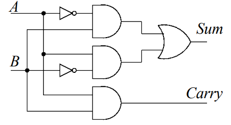
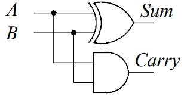
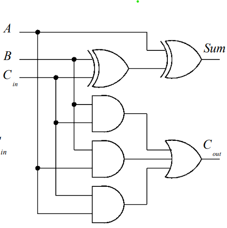
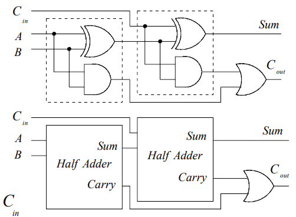
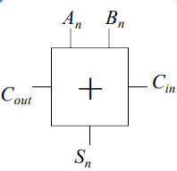

# Digital Systems Design 2

## Combinational Logic

### Implemetation of Arithmetic Functions

#### Binary Half-Adder

We wish to design a circuit to add two single bit numbers $A$ and $B$. We start with the truth table:

| $A$ | $B$ | $C_{out}$ | $Sum$ |
|---|---|---|-----|
| 0 | 0 | 0 | 0 |
| 0 | 1 | 0 | 1 |
| 1 | 0 | 0 | 1 |
| 1 | 1 | 1 | 1 |

Synthesising the above truth table for the outputs $C_{out}$ and $Sum$ we get the following boolean expressions:

$$C_{out} = A.B$$

$$Sum = \overline{A}.B + A.\overline{B} = A \oplus B$$

The logic-circuit implemetation of the binary half-adder is:

    

Or equivalently using an XOR gate:

    

#### Binary Full-Adder

Full binary addition requires both an input carry $C_{in}$ and output carry $C_{out}$. Once again we will start with the truth table:

| $A$ | $B$ | $C_{in}$ | $C_{out}$ | $Sum$ |
|-----|-----|----------|-----------|-------|
| 0 | 0 | 0 | 0 | 0 |
| 0 | 0 | 1 | 0 | 1 |
| 0 | 1 | 0 | 0 | 1 |
| 0 | 1 | 1 | 1 | 0 |
| 1 | 0 | 0 | 0 | 1 |
| 1 | 0 | 1 | 1 | 0 |
| 1 | 1 | 0 | 1 | 0 |
| 1 | 1 | 1 | 1 | 1 |

A simple way to synthesise this truth table into the correpoding (simplified) binary expressions utilises Karnaugh maps. The Karnaugh map for $C_{out}$ is:

    

$$C_{out} = A.B + A.C_{in} + B.C_{in}$$

    

$$Sum = \overline{A}.B.\overline{C_{in}} + A.\overline{B}.\overline{C_{in}} + \overline{A}.\overline{B}.C_{in} + A.B.C_{in} $$

It is not immediately obvious that the sum expression can be simplifed further using XOR's. Proving the general formula for $\overline{A \oplus B}$:

$$\overline{A \oplus B} = \overline{A.\overline{B} + \overline{A}.B} = \left(\overline{A.\overline{B}} \right) . \left(\overline{\overline{A}.B} \right) = (\overline{A} + B).(A + \overline{B}) = \overline{A}.\overline{B} + A.B$$

The checkerboard Karnaugh map pattern hints at the XOR pattern, thus simplifying the expression for $Sum$:

$$Sum = \overline{A}.B.\overline{C_{in}} + A.\overline{B}.\overline{C_{in}} + \overline{A}.\overline{B}.C_{in} + A.B.C_{in}$$

$$= \overline{C_{in}}(\overline{A}.B + A.\overline{B}) + C_{in}(\overline{A}.\overline{B} + A.B)$$

$$ \overline{C_{in}}(A \oplus B) + C_{in}(\overline{A}.\overline{B} + A.B)$$

$$= \overline{C_{in}}(A \oplus B) + C_{in}(\overline{A \oplus B})$$

$$= A \oplus B \oplus C_{in}$$

The full-adder circuit implementation is:

    

Logically, a full-adder is an extension of the half-adder with a carry input $C_{in}$. The half adder outputs $C_{ha}=A.B$ and sum $Sum_{ha} = A \oplus B$. The full adder sumation is simply the XOR of half-adder sum output $Sum_{ha}$ with the input $C_{in}$:

$$Sum_{fa} = A \oplus B \oplus C_{in} = Sum_{ha} \oplus C_{in}$$

Similarly the full-adder carry output $C_{out}$ can be implemented using half-adders:

$$C_{out} = A.B + A.C_{in} + B.C_{in}$$

$$= A.B + (A + B).C_{in}$$

As the case where both $A$ and $B$ are true is covered by the first min-term in the expresion the second term can be changed to XOR, without changing the expressions value:

$$C_{out} = A.B + (A + B).C_{in}$$

$$= A.B + (A \oplus B).C_{in}$$

$$= A.B + (Sum_{ha}).C_{in}$$

The full-adder can thus be implemented using half-adder's:

    

The full-adder circuit symbol is:

    

<!-- #### Ripple Carry Adder -->

## Karnaugh Maps

TODO: Complete section
