# Boolean Algebra

## Boolean Operations

### NOT

The NOT operation produces a high output if X is low with the following algebraic representation:

$$\overline{X}$$

The truth table can be seen below:

| $X$ | $\overline{X}$ |
|---|-----|
| 0 | 1 |
| 1 | 0 |

The circuit diagram symbol for a NOT gate is:

    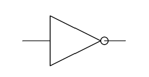

### AND

The AND operation produces a high output if X and Y are high with the following algebraic representation:

$$X \cdot Y$$

The truth table can be seen below:

| $X$ | $Y$ | $X \cdot Y$|
|---|---|-----|
| 0 | 0 | 0 |
| 0 | 1 | 0 |
| 1 | 0 | 0 |
| 1 | 1 | 1 |

The circuit diagram symbol for an AND gate is:

    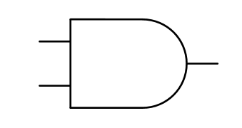

### OR

The OR operation produces a high output if either X or Y is high with the following algebraic representation:

$$X + Y$$

The truth table can be seen below:

| $X$ | $Y$ | $X + Y$|
|---|---|-----|
| 0 | 0 | 0 |
| 0 | 1 | 1 |
| 1 | 0 | 1 |
| 1 | 1 | 1 |

The circuit diagram symbol for an OR gate is:

    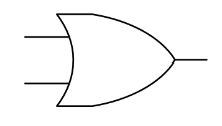

### NAND

The NAND operation produces a high output unless X and Y are high with the following algebraic representation:

$$\overline{X \cdot Y}$$

The truth table can be seen below:

| $X$ | $Y$ | $\overline{X \cdot Y}$|
|---|---|-----|
| 0 | 0 | 1 |
| 0 | 1 | 1 |
| 1 | 0 | 1 |
| 1 | 1 | 0 |

The circuit diagram symbol for a NAND gate is:

    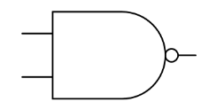

### NOR

The NOR operation produces a high output if X and Y are low with the following algebraic representation:

$$\overline{X + Y}$$

The truth table can be seen below:

| $X$ | $Y$ | $\overline{X + Y}$|
|---|---|-----|
| 0 | 0 | 1 |
| 0 | 1 | 0 |
| 1 | 0 | 0 |
| 1 | 1 | 0 |

The circuit diagram symbol for a NOR gate is:

    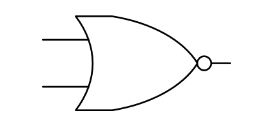

### XOR

The XOR (exclusive OR) operation produces a high output exclusively when X or Y are high, not including the case where both inputs are high, with the following algebraic representation:

$$X \oplus Y$$

The truth table can be seen below:

| $X$ | $Y$ | $X \oplus Y$|
|---|---|-----|
| 0 | 0 | 0 |
| 0 | 1 | 1 |
| 1 | 0 | 1 |
| 1 | 1 | 0 |

The circuit diagram symbol for an XOR gate is:

    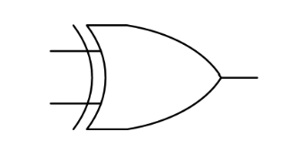

## Basic Principles and Laws

### Duality Principle

$$X + 0 = X \quad \textrm{and} \quad X \cdot 0 = 0$$

$$X + 1 = 1 \quad \textrm{and} \quad X \cdot 1 = X$$

### Idempotent Law

$$X + X = X \quad \textrm{and} \quad X \cdot X = X$$

### Commutative Law

$$X + Y = Y + X \quad \textrm{and} \quad X \cdot Y = Y \cdot X$$

The order of two terms undergoing an operation can be switched without changing the value of the expression making Boolean Logic commutative

### Associative Law

$$(X + Y) + Z = X + (Y + Z)$$

$$(X \cdot Y) \cdot Z = X \cdot (Y \cdot Z)$$

If the same operation is being applied to multiple terms the order of the terms and placement of the brackets is changeable

### Distributivity

Factoring Law:
$$(X + Y) \cdot (X + Z) = X + (Y \cdot Z)$$

Brackets can be expanded and simplified

Distributive law:
$$(X \cdot Y) + (X \cdot Z) = X \cdot (Y + Z)$$

Common terms can be taken out of brackets similar to standard algebra

### Complementation

$$X + \overline{X} = 1 \quad \textrm{and} \quad X \cdot \overline{X} = 0$$

Performing a boolean operation on an input A as well as $\overline{A}$ will result in 1 for OR and 0 for AND

### Absorption

First form:

$$X + X \cdot Y = X \quad \textrm{and} \quad X \cdot (X + Y) = X$$

Second form:

$$X + \overline{X} \cdot Y = X + Y \quad \textrm{and} \quad X \cdot (\overline{X} + Y) = X \cdot Y$$

### Logic Adjacency

$$Y \cdot X + Y \cdot \overline{X} = Y\quad \textrm{and} \quad (Y + X) \cdot (Y + \overline{X}) = Y$$

When X and $\overline{X}$ can be factored out the equation can be simplified using complementation:

### Consensus

$$X \cdot Y + Y \cdot Z + Z \cdot \overline{X} = X \cdot Y + Z \cdot \overline{X}$$

$$(X + Y) \cdot (Y \cdot Z) \cdot (Z \cdot \overline{X}) = (X + Y) \cdot (Z \cdot \overline{X})$$

### Involution

$$\overline{\overline{X}} = X$$

The double complement of any given value will result in the original value:

## De Morgan's Theorem

De Morgan's Theorem states that a logical operation of 2 variables can be substituted by the negation of the operation's counterpart:

$$X \cdot Y = \overline{\overline{X} + \overline{Y}}$$

$$X + Y = \overline{\overline{X} \cdot \overline{Y}}$$

This concept can be extended for repeated operations:

$$X_1 \cdot X_2 \cdot ... \cdot X_n = \overline{\overline{X_1} + \overline{X_2} + ... + \overline{X_n}}$$

$$X_1 + X_2 + ... + X_n= \overline{\overline{X_1} \cdot \overline{X_2} \cdot ... \cdot \overline{X_n}}$$

## NAND and NOR design

The NAND and NOR Boolean functions are both functionally complete, meaning that any combination of the fundamental logic gates can be expressed with only NAND or NOR gates. In practice this is used in factories to obtain higher yields due to the repetitive process of manufacturing the same gate.

### NAND-only design

All the fundamental logic gates can be obtained only using NAND gates. A NOT gate can be created by connected the two inputs:

    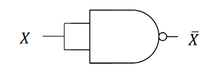

AND can be obtained by inverting the output of a NAND gate:

    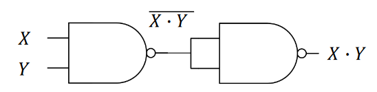

OR can be found using De Morgan's and inverting the inputs to a NAND gate:

    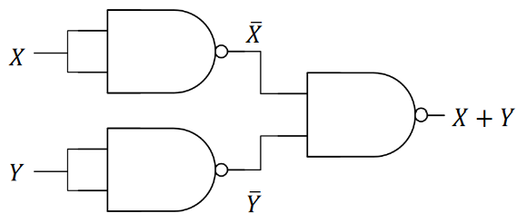

### NOR-only design

Similar to NAND-only design all the fundamental logic gates can also be obtained using NOR gates. Similarly, a NOT gate can be created by connected the two inputs:

    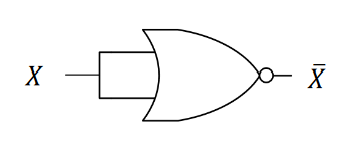

OR can be obtained by inverting the output of a NOR gate:

    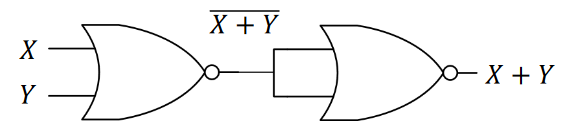

AND can be found using De Morgan's and inverting the inputs to a NOR gate:

    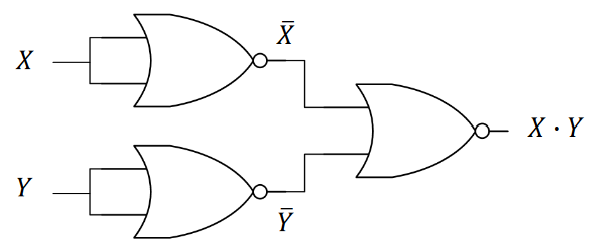

## Minterms and Maxterms

### Minterms

If an AND term in a Boolean expression contains all the direct or negated variables in the entire expression, it is called a fundamental product or minterm:

$$f(X_1,X_2,X_3) = X_1 \cdot X_2 \cdot \overline{X_3} \quad \textrm{is a minterm}$$

An n-variable function has $2^n$ minterms since every variable in the function must be a part of a minterm, in its direct or negated form. There is only one combination of variables for which a certain minterm equals 1 (in this case $X_1 = 1,\  X_2 = 1,\  X_3 = 0$)

### Maxterms

If an OR term in a Boolean expression contains all the direct or negated variables in the entire expression, it is called a fundamental sum, or maxterm. As above, if there are n-variables, there are $2^n$ maxterms:

$$f(X_1,X_2,X_3) = X_1 + \overline{X_2} + X_3 \quad \textrm{is a maxterm}$$

There is only one combination of variables for which a certain maxterm equals 0 (in this case $X_1 = 0,\  X_2 = 1, \  X_3 = 0$)
