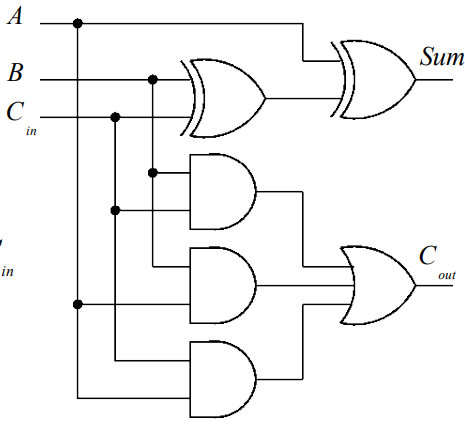

# Combinational Logic

## Implementation of Arithmetic Functions

### Binary Half-Adder

We wish to design a circuit to add two single bit numbers $A$ and $B$. We start with the truth table:

| $A$ | $B$ | $C_{out}$ | $Sum$ |
|---|---|---|-----|
| 0 | 0 | 0 | 0 |
| 0 | 1 | 0 | 1 |
| 1 | 0 | 0 | 1 |
| 1 | 1 | 1 | 1 |

Synthesizing the above truth table for the outputs $C_{out}$ and $Sum$ we get the following boolean expressions:

$$C_{out} = A.B$$

$$Sum = \overline{A}.B + A.\overline{B} = A \oplus B$$

The logic-circuit implementation of the binary half-adder is:

    

Or equivalently using an XOR gate:

    

### Binary Full-Adder

Full binary addition requires both an input carry $C_{in}$ and output carry $C_{out}$. Once again we will start with the truth table:

| $A$ | $B$ | $C_{in}$ | $C_{out}$ | $Sum$ |
|-----|-----|----------|-----------|-------|
| 0 | 0 | 0 | 0 | 0 |
| 0 | 0 | 1 | 0 | 1 |
| 0 | 1 | 0 | 0 | 1 |
| 0 | 1 | 1 | 1 | 0 |
| 1 | 0 | 0 | 0 | 1 |
| 1 | 0 | 1 | 1 | 0 |
| 1 | 1 | 0 | 1 | 0 |
| 1 | 1 | 1 | 1 | 1 |

A simple way to synthesize this truth table into the corresponding (simplified) binary expressions utilizes Karnaugh maps. The Karnaugh map for $C_{out}$ is:

    

$$C_{out} = A.B + A.C_{in} + B.C_{in}$$

    

$$Sum = \overline{A}.B.\overline{C_{in}} + A.\overline{B}.\overline{C_{in}} + \overline{A}.\overline{B}.C_{in} + A.B.C_{in} $$

It is not immediately obvious that the sum expression can be simplified further using XOR's. Proving the general formula for $\overline{A \oplus B}$:

$$\overline{A \oplus B} = \overline{A.\overline{B} + \overline{A}.B} = \left(\overline{A.\overline{B}} \right) . \left(\overline{\overline{A}.B} \right) = (\overline{A} + B).(A + \overline{B}) = \overline{A}.\overline{B} + A.B$$

The checkerboard Karnaugh map pattern hints at the XOR pattern, thus simplifying the expression for $Sum$:

$$Sum = \overline{A}.B.\overline{C_{in}} + A.\overline{B}.\overline{C_{in}} + \overline{A}.\overline{B}.C_{in} + A.B.C_{in}$$

$$= \overline{C_{in}}(\overline{A}.B + A.\overline{B}) + C_{in}(\overline{A}.\overline{B} + A.B)$$

$$ \overline{C_{in}}(A \oplus B) + C_{in}(\overline{A}.\overline{B} + A.B)$$

$$= \overline{C_{in}}(A \oplus B) + C_{in}(\overline{A \oplus B})$$

$$= A \oplus B \oplus C_{in}$$

The full-adder circuit implementation is:

    

Logically, a full-adder is an extension of the half-adder with a carry input $C_{in}$. The half adder outputs $C_{ha}=A.B$ and sum $Sum_{ha} = A \oplus B$. The full adder summation is simply the XOR of half-adder sum output $Sum_{ha}$ with the input $C_{in}$:

$$Sum_{fa} = A \oplus B \oplus C_{in} = Sum_{ha} \oplus C_{in}$$

Similarly the full-adder carry output $C_{out}$ can be implemented using half-adders:

$$C_{out} = A.B + A.C_{in} + B.C_{in}$$

$$= A.B + (A + B).C_{in}$$

As the case where both $A$ and $B$ are true is covered by the first min-term in the expression the second term can be changed to XOR, without changing the expressions value:

$$C_{out} = A.B + (A + B).C_{in}$$

$$= A.B + (A \oplus B).C_{in}$$

$$= A.B + (Sum_{ha}).C_{in}$$

The full-adder can thus be implemented using half-adder's:

    

The full-adder circuit symbol is:

    

### Ripple Carry Adder

The full addition of $A_{3:0} = \\{A_3, A_2, A_1, A_0 \\}$ and $B_{3:0} = \\{B_3, B_2, B_1, B_0 \\}$ generating $S_{3:0} = \\{S_3, S_2, S_1, S_0 \\}$ can be implemented using consecutive full-adder's:

    

The Sum outputs $S_{3:0}$ are generated as the carry ripples through the chain of adders. 

#### Ripple Carry Adder Delay

The delay time depends on the number of logic states that must be traversed by the circuit. This time is dependant on the applied input signals $A_{n-1:0}$ and $B_{n-1:0}$, as the number of rippled states changes.

#### Ripple Carry Adder Critical Path Delay
Critical Path: The worst case propagation delay. Occurs when ripple propagates from least significant bit (lsb) to most significant bit (msb)

Defining:

- Propagation delay from $C_{in}$ to $C_{out}$ as $t_{carry}$
- Propagation delay from $C_{in}$ to $Sum$ as $t_{sum}$

Assuming the delay from input signals $A_0$ and $B_0$ to $C_{out, 0}$ for the lsb is the same as the delay from $C_{in}$ to $C_{out}$ ($t_{carry}$) for all other bits.

The Ripple Carry Adder delay $t_{adder}$ can thus be approximated as:

$$t_{adder} \approx (n-1)t_{carry} + t_{sum}$$

Clearly $t_{adder}$ increases linearly with the number of bits $n$, and it is thus important to prioritize the optimization of $t_{carry}$ over $t_{sum}$

>**Note:** Looking at the circuit implementation of the [full-adder](#binary-full-adder) changes to the lsb inputs $(A_0, B_0)$ must propagate through an XOR, 2 AND and an OR gate before reaching the carry output $C_{out}$ whereas changes to the carry in inputs $C_{in}$ for further bits must only propagate through an XOR gate. A more exact formula for the critical path delay is thus: $t_{adder} = t_{lsb} + (n-2)t_{carry} + t_{sum}$, where $t_{lsb} > t_{carry}$

### Carry Lookahead Adder

| $a_{i}$ | $b_{i}$ | $c_{i}$ | $c_{i+1}$ | $s_{i}$ | Carry Status |
|-----|-----|----------|-----------|-------|--------------|
| 0 | 0 | 0 | 0 | 0 | Delete |
| 0 | 0 | 1 | 0 | 1 | Delete |
| 0 | 1 | 0 | 0 | 1 | Propagate |
| 0 | 1 | 1 | 1 | 0 | Propagate |
| 1 | 0 | 0 | 0 | 1 | Propagate |
| 1 | 0 | 1 | 1 | 0 | Propagate |
| 1 | 1 | 0 | 1 | 0 | Generate |
| 1 | 1 | 1 | 1 | 1 | Generate |

As per the table above, the carry output signal $c_{i+1}$ is generated $G_{i}$ in the case that both $a_{i}$ and $b_{i}$ are 1, or propagated $P_{i}$ (passed through from $c_{i}$) when either $A$ or $B$ (not both) are 1:

$$G_{i} = a_{i}.b_{i}$$

$$P_{i} = a_{i} \oplus b_{i}$$

Looking at the [Full-Adder](#binary-full-adder) circuit, $G_{i}$ is clearly the carry output and the $P_{i}$ is the sum of the first [Half-Adder](#binary-half-adder) the circuit is comprised of:

    

The full-adder outputs can be re-written as:

$$s_{i} = a_{i} \oplus b_{i} \oplus c_{i} = P_{i} \oplus c_{i}$$

$$c_{i+1} = a_{i}.b_{i} + (a_{i} \oplus b_{i}).c_{i} = G_{i} + P_{i}.c_{i}$$

The outputs $G_{i}$ and $P_{i}$ are far simpler functions then $c_{i+1}$ and $s_{i}$, thus they will be available faster. Using this we do not need to wait for the carry signal to ripple through all the previous stages. For a 4-bit adder this would be:

$$c_{1} = G_{0} + P_{0}.c_{0}$$

$$c_{2} = G_{1} + P_{1}.G_{0} + P_{1}.P_{0}.c_{0}$$

$$c_{3} = G_{2} + P_{2}.G_{1} + P_{2}.P_{1}.G_{0} + P_{2}.P_{1}.P_{0}.c_{0}$$

$$c_{4} = G_{3} + P_{3}.G_{2} + P_{3}.P_{2}.G_{1} + P_{3}.P_{2}.P_{1}.G_{0} + P_{3}.P_{2}.P_{1}.P_{0}.c_{0}$$

All the propagate and generate signals are available at the same time. This is followed by the carry output $c_{0}$. Notice consecutive carry outputs $c_{i+1}$ are only dependent on the propagate, generate and $c_{0}$ signals. The carry output $c_{4}$ requires a 5-input AND gate and a 5-input OR gate, and is available after passing through these gates. 4,3 and 2-input AND gates are also required, although they are not the bottleneck. A 4-bit CLA is shown:

    

As described above, the requirement for AND/OR gates with a high number of inputs means the carry logic block gets very complicated quickly. Therefore, CLA adders are usually implemented as 4-bit modules and used in hierarchical structure to implement adders with multiples of 4-bits.

For further information view:
- [Carry Lookahead Adder Article](https://www.ece.uvic.ca/~fayez/courses/ceng465/lab_465/project1/adders.pdf)
- [Carry Lookahead Adder Video](https://www.youtube.com/watch?v=Esvcy5nbH90)

### Binary Subtracter

#### 2's Complement

TODO: Complete

## CMOS Implementation of Boolean Functions

Complementary Metal Oxide Semiconductor technology (CMOS)

- Most common integrated circuit technology
- Used to implement digital circuits as it provides high noise immunity and low static power consumption
- Can also be used to implement analogue circuits and image sensors
- Continued development of this technology has allowed extremely small transistor size
- current microprocessors contain hundreds of millions of CMOS logic gates (transistors) on a single chip

### Switches

There are two fundamental transistors/switches used in CMOS: NMOS and PMOS transistors. The transistors considered in this course are all enhancement mode. The N/P in the transistor name refers to the source and drain material, and thus also the channel

#### NMOS transistor

    

As indicated by the single line on the symbol above, the NMOS transistor is On/closed when the control signal G is high

Due to n-type source and drain:
- Poor conduction when A/B is high
- Good conduction when A/B is low
- Therefore, the NMOS transistor is used in pull-down networks

Due to the source being n-type we must connect it to a source of electrons: $V_{ss}$

#### PMOS transistor

    

As indicated by the circle above the single line on the symbol above, the PMOS transistor is On/closed when the control signal G is low

Due to p-type source and drain:
- Poor conduction when A/B is low
- Good conduction when A/B is high
- Therefore, the PMOS transistor is used in pull-up networks

Due to the source being p-type we must connect it to a source of holes: $V_{dd}$

### Transmission Gate - Bi-Lateral CMOS Switch
As described in the [Switches](#switches) section above, NMOS/PMOS transistors have opposing conductivity properties. The combination of these conductivity characteristics can thus be used to transmit both strong logic high and low signals in any direction without signal degradation. Connecting PMOS and NMOS devices together in parallel we create the basic bi-lateral CMOS switch, or "Transmission Gate". The CMOS implementation (left) and the circuit symbol (right) are:

    

>**Note:** The transmission gate is somewhat different to normal CMOS logic gates. Due to symmetry, the input and output are interchangeable. The circuit symbol with 2 opposite pointing triangles indicates this, as does the bi-lateral name

For more info view: [Transmission Gate](https://www.electronics-tutorials.ws/combination/transmission-gate.html)

### NOT gate
The NOT gate can be implemented using CMOS technology as:

    

Clearly, the NMOS pulls down the output ($out$) when the input signal ($in$) is high, and the PMOS is turned off. Similarly, the PMOS pulls up the output ($out$) when the input signal ($in$) is low, and the NMOS is turned off

The following signals show the CMOS inverter transient behavior:

    

- The input is an ideal signal
- The output is shown including propagation delay, rise and fall times
- The gate consumes virtually no power for static signals
- Power consumed when signal changes

### NAND gate
The NAND gate corresponds to the following logical expression $F = \overline{A.B}$. The output of the gate $F$ is low (pulled down) when both $A$ and $B$ are true ($\overline{F} = A.B$). Applying DeMorgan's law the equivalent logical expression is $F = \overline{A.B} = \overline{A} + \overline{B}$. Clearly the output of the gate $F$ is high (pulled up) when $A$ or $B$ are low, this corresponds to the parallel PMOS pull up network configuration. The NAND gate can thus be implemented using CMOS technology as:

    

Similarly, a 3-input NAND gate can be implemented using CMOS technology as:

    

### NOR gate
The NOR gate corresponds to the following logical expression $F = \overline{A + B}$. The output of the gate $F$ is low (pulled down) when either $A$ and $B$ are true ($\overline{F} = A + B$). Applying DeMorgan's law the equivalent logical expression is $F = \overline{A + B} = \overline{A}.\overline{B}$. Clearly the output of the gate $F$ is high (pulled up) when both $A$ and $B$ are low, this corresponds to the series PMOS pull up network configuration. The NOR gate can thus be implemented using CMOS technology as:

    

Similarly, a 3-input NOR gate can be implemented using CMOS technology as:

    

### AND gate
It is not possible to implement the AND gate using only a simple pull-up and pull-down network. An AND gate can thus be implemented as an [NAND gate](#nand-gate) followed by a [NOT gate](#not-gate):

    

### OR gate
Similarly, as with an [AND gate](#and-gate) it is not possible to implement the OR gate using only a simple pull-up and pull-down network. An OR gate can thus be implemented as an [NOR gate](#nor-gate) followed by a [NOT gate](#not-gate):

    

### Number of Transistors per gate
Different gates require different numbers of transistors to implement:

- 4 transistors to implement 2-input NAND/NOR gates
- 6 transistors to implement 2-input AND/OR gates

Using a CMOS implementation of boolean expressions it is more efficient to use NAND/NOR gates as opposed to AND/OR gates. When possible, DeMorgans's laws can be used to convert NAND/NOR expressions

### NAND vs NOR
Hole mobility is lower then electron mobility. PMOS transistors utilize holes as majority charge carriers, whereas NMOS use electrons. Due to this PMOS transistors have less drive strength then equivalent geometry NMOS transistors.

[NAND gates](#nand-gate) use:
- PMOS in parallel
- NMOS in series

[NOR gates](#nor-gate) use:
- PMOS in series
- NMOS in parallel

As a consequence, due to PMOS transistors in series, NOR gates are slower than NAND gates. A NAND gate also typically occupies less area than a NOR gate

### General CMOS gates
More complex CMOS gates can be constructed for general logic functions. The process for constructing such gates is similar to the way the fundamental gates were derived. Start with an expression in the form $F=\overline{SOP}$ to build the pull down network. Use DeMorgan's rules or duality principles to derive the pull-up network. If the expression $F=\overline{SOP}$ does not include a negation then an inverter will be needed at the output of the network.

Important notes:
- The function should have an equal number of NMOS and PMOS gates
- The NMOS/PMOS devices are duals of each other. Series pull-down NMOS correspond to parallel pull-up PMOS. Parallel pull-down NMOS correspond to series pull-up PMOS

## Karnaugh Maps

TODO: Complete section
