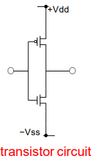
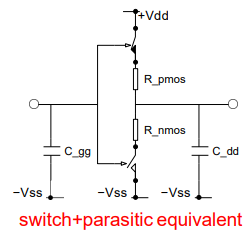
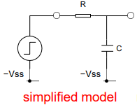
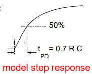

# Design Synthesis

## Fabrics 

Within a Fabric physical logic gates and interconnect (wires) can be found which are either fixed (hard-wired) or flexible (reconfigurable/programmable). Different fabrics provide different balances of logic and interconnect quantity and quality as well as flexibility. Different fabrics also give different technical (energy, size, speed, reliability) and commercial (cost, reliability, time-to-market) performance options.

### Custom Gate ASIC

The custom gate Application Specific Integrated Circuit (ASIC) provides static configuration of logic (hard-wired) with no flexibility after the chip has been created. ASIC has the following properties:

- configurable substrate, diffusion, implantation from a fixed menu
- configurable transistor sizes, wire thickness 
- configurable NAND/NOR gate-level physical structure
- configurable block-level physical structure floor-planning 
- configurable interconnect physical structure floor-planning
- total physical chip size, speed and energy trade-off is possible
- high technical performance
- typically large sales volume

### Library Cell ASIC

Library Cell ASIC, similar to custom gate ASIC, provides static configuration of logic, but trades some of the performance and configurability of custom gate ASIC for a faster design process. Library Cell ASIC has the following properties

- configurable transistor sizes, wire thickness from a fixed menu
- configurable AND/NOR gate-level physical structure from a fixed menu
- configurable block-level physical structure floor-planning 
- configurable interconnect physical structure floor-planning
- partial physical chip size, speed and energy trade-off is possible
- good technical performance
- typically moderate sales volume

### FPGA

Field Programmable Gate Arrays have fixed gates and wiring, while offering reconfigurability through memory. FPGA has the following properties:

- physical chip fabrication process is already complete
- fixed NAND/NOR gate-level physical structure
- programmable block-level logical structure
- programmable interconnect logical structure
- Rapid synthesis and zero physical fabrication gives short time-to-market
- physical chip size, speed, energy trade-off is fixed by choice of chip
- acceptable technical performance
- typically small sales volume

### Computer Processor/Microcontroller

In processors or microcontrollers typically all the physical circuit features, physical logic architecture and some logical behaviour features are fixed by physically pre-constructed chip. The properties are as follows:

- chip fabrication process is already complete
- logic and interconnect structure complete
- programmable logical behaviour, with serialisation restrictions
- potentially rapid design and short time-to-market
- physical chip size, speed and energy trade-off fixed by choice of chip
- acceptable technical performance at moderate to low commercial cost
- any sales volume can be accommodated

### Comparison of Fabrics

| specification | custom ASIC | Library ASIC | FPGA | Processors |
|---|---|---|---|---|
| transistor/wire size | configurable | partially configurable | fixed | fixed | 
| NAND/NOR structure | configurable | partially configurable | fixed | fixed | 
| block-level structure | configurable | configurable | programmable | fixed | 
| interconnect structure | configurable | configurable | programmable | fixed | 
| time-to-market | slow | moderate | fast | fast | 
| technical performance | high | good | moderate | moderate | 
| sales volume  | high | moderate | low | any | 

## Timing Considerations

### CMOS Logic Gate Propagation Delay Model
A transistor circuit such as that of a NOT gate:

    

Can equivalently be modelled as ideal switches with additional parasitic resistances and (parallel) capacitance:

    

The parasitic components can be clumped together, and the ideal switches replaced by an ideal switching voltage source:

    

This equivalent circuit behaves like an RC charging circuit:

    

The time constant $\tau = RC$ corresponds to the circuit components and is directly proportional to the fan-out (the number of other gate inputs and loads connected to the output). Using the RC charging equation:

$$V = V_{dd}(1 - e^{-t/RC}) \implies \frac{V_{dd}}{2} = V_{dd}(1 - e^{-t_{PD}/RC}) \implies t_{PD} = RC * \ln(2) \approx 0.7RC$$

### Wire/Interconnect propagation delay model

Short On-Chip Interconnects:

Have essentially zero resistance, but significant capacitance. This can be modelled by adding extra capacitance to the [Logic Gate Propagation Delay Model](#cmos-logic-gate-propagation-delay-model)

Long On-Chip Interconnects:

Significant resistance and capacitance, thus this can be modelled as a separate interconnect $t_{PD}$ parameter as per the [Logic Gate Propagation Delay Model](#cmos-logic-gate-propagation-delay-model)

Off-Chip Long Interconnects:

These have significant inductance as well as resistance and capacitance. This is modelled using complex RLC or electromagnetic models, used to predict the interconnect $t_{PD}$ value and the edge distortion/reflexion effects: significant for CLOCK signals

TODO: Add more on this

CLOCK:

This is a simple signal, however it is a complex distribution problem. Thus separate specifically designed interconnect is used, with goal of minimising [clock skew](#clock-skew)

### Clock Skew

TODO: Complete

### Maximum Clock Frequency

TODO: Complete

### Hold Time Violation
In order to prevent hold time violation, the following equation must be satisfied:

$$t_{PD} - t_{CS} > t_{h}$$

As visible, this has no relation to the clock period, so changing the clock period will not fix this problem. One must reduce the clock skew or add extra delay to the problem data signal. This situation is not common, and only occurs if the total propagation delay is very small (shift registers) or the clock skew is large.

>**Note:** Minimum $t_{PD}$ must be used, as this is the worst case for hold time calculations
