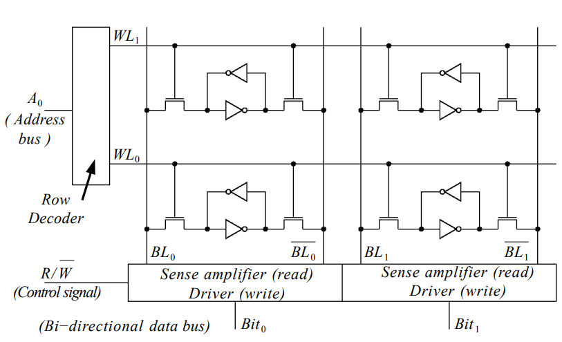

# Sequential Logic and Memory

## The D-Latch and D-Flip Flop

### Circuit-level feedback

#### Feedback over odd number of invertor:
Taking an invertor and connecting it with feedback gives unstable behavior. This may be used as a basis of an analogue oscillator. Not particularly useful for time-controlled logic digital systems.

    

#### Feedback over even number of invertors
Signal feedback around an even number of two or more invertors is stable, and may adopt one of two stable conditions. This is useful for logic systems if the stable condition can be set by other combinational circuit signals.

    

### D-Latch (Positive Transparent Latch)
Considering the stable feedback loop with two invertors, as above. If we add switches to the input $S_{in}$ and feedback paths $S_{fb}$, then the stable condition can be externally controlled:

    

With $S_{in}$ closed and $S_{fb}$ open the circuit copies the input $D$ to the stable state of the latch.

    

With $S_{in}$ open and $S_{fb}$ closed the circuit remembers the state it was in. This isolated the data input $D$ and allows the output to be visible at output $Q$.

The switches used for the latch are [Transmission Gates](https://github.com/JakubRichardson/DSD2-Notes/blob/master/Notes/Combinational.md#transmission-gate---bi-lateral-cmos-switch). Clearly we wish the switched $S_{in}$ and $S_{fb}$ to be opposite to each other. This circuit is called the D-Latch, with corresponding circuit symbol:

    

When $G$ is high D/Q path is transparent. When G falls from high to low the output Q is frozen/memorized. Assuming the positive logic convention (low = 0, high = 1), the D-Latch operation table is:

| $G$ | $D$ | $Q_{i+1}$ | State |
|-----|-----|-----|-------|
| 1 | $D$ | $D$ | Transparent |
| $\downarrow$ | $D$ | $D$ | Input Captured |
| 0 | * | $Q_{i}$ | Output value held |

The D-Latch transparent condition means data could be missed as the data capture window depends on the control signal $G$. This window can be minimized by using two D-latches in series, this is called a [D-Flip-Flop](#d-flip-flop)

### D-Flip-Flop

TODO: Complete

## Memory
Only the basics of memory are covered in this course. For example: details of how driver and sense amplifier work were not covered.

### SRAM
SRAM - Static Random Access Memory

Static: Does not require refresh mechanism

Random Access: Information stored in SRAM array can be accessed in any order

Memory: Ability to store bit information

$Read/\overline{Write}$: $R/\overline{W}$ control line used to distinguish reading and writing operations
- Sense amplifier used to read SRAM cells
- Driver used to write to SRAM cells

Volatile: Memory content lost when power supply switched off

Used in: Commonly used in cache applications due to high speed, and on devices such as Microprocessors, FPGAs, ASICs, etc to provide on chip storage

#### SRAM Cell
An SRAM cell is constructed using feedback around 2 invertors. Although NMOS transistors cannot conduct strong high signals, they are used instead of Transmission gates. NMOS transistors are feasible as they do not need to provide full swing to the bit lines, and they minimize the SRAM cell complexity. The use of NMOS transistors, however, requires a complicated driver and sense amplifier.

    

An NMOS transistors on both sides of the invertor memory cell is not necessary (one would suffice). They are, however, used to provide differential change to the bit line voltages, improving noise margin.

#### SRAM Array
An SRAM Array can be constructed as follows:

    

The address bus $A_{0}$ is used to read and write using the $WL_{0}$ and $WL_{1}$ write lines. The choice between read and write operations is set using the $R/\overline{W}$ control signal. The [read](#sram---read-operation) and [write](#sram---write-operation) operations are explained in more detail below.

#### SRAM - Read operation
Below shown is an example of how reading the top row of an SRAM array is performed: 

    

To read from the SRAM array, sense amplifiers are used. The read control signal is used to setup the sense amplifiers. The row decoder is used to choose the top write line. This turns the NMOS transistors on, ready for reading. The sense amplifiers read the SRAM cells using the bit lines, leaving the SRAM cells in their previous state. These then output the data on the bi-directional data bus.

Not covered as part of course: The sense-amplifiers pre-charge the bit lines to $V_{dd}$ (or $\frac{V_{dd}}{2}$) and observe the voltage changes due to the SRAM cells. The pre-charge circuits are turned off before reading. The differential change to the voltage on the bit lines is used to determine the cell voltage.

#### SRAM - Write operation
Below shown is an example of how writing data to the bottom row of an SRAM array is performed:

    

To write to the SRAM array, drivers are used. The write control signal is used to setup the drivers. The drivers receive the data to be written to the array on the bi-directional data bus. The row decoder is used to choose the bottom write line. This turns the NMOS transistors on, ready for writing. The memory cell values are set. Similarly as with the reading operation, drivers use the differential bit lines to make writing to the SRAM cells easier.

Not covered in course: The pre-charge circuits are maintained on throughout the write operation in order to overpower the memory cell (write properly).

#### Generic SRAM array
In the model shown so far we must read all the bits connected to the word line on that row. If we wish to expand the memory capacity while maintaining the same word size then the aspect ratio would quickly become out of hand. The row decoder would become in-feasibly complicated very quickly. A column decoder is thus used to include multiple words in a single row:

    

In order to minimize decoding complexity an aspect ratio of 1 is ideal.

TODO: Add more detail on SRAM including reading, writing and standby operations using resources:

[SRAM Cell Video](https://www.youtube.com/watch?v=mwNqzc1o5zM)

[SRAM Read/Write video](https://www.youtube.com/watch?v=0T6CWN_y3Ic)

[SRAM Read/Write video 2](https://www.youtube.com/watch?v=0T6CWN_y3Ic)

[SRAM article](https://www-users.york.ac.uk/~pcc1/pc_history/Static_random_access_memory.html)

### DRAM
DRAM - Dynamic Random Access memory

Dynamic: Requires refresh mechanism to maintain memory contents

Speed: DRAM is slower than SRAM

Size: DRAM more compact than SRAM due to simpler component structure (1:4 ratio)
- Due to size (and price) DRAM is popular for large memory
- Used as external memory in microprocessor systems

Volatile: Loses memory information when power supply turned off

#### DRAM Cell
The DRAM cell consists of an NMOS transistor $M_{1}$ and a capacitor $C$:

    

The transistor is not an ideal switch, so the capacitor slowly discharges due to leakage current, therefore, the cell must be refreshed regularly. The refresh operation is essentially a read operation followed by re-writing the cell with that value.

#### DRAM - Write operation
To write to a DRAM cell, the bit line $BL$ is pre-charged to high/low corresponding to the bit to be stored. The pre-charge circuit is left on. The word line $WL$ is set to high $WL=1$, and the transistor $M_{1}$ is switched on. The capacitor $C$ charges or discharges through the bit line. The word line is set to low $WL=0$. The transistor $M_{1}$ is switched off, and the value is stored on the now isolated capacitor.

#### DRAM - Read operation
To read from a DRAM cell, the write line must start low $WL=0$, so the transistor is off and the capacitor is isolated. The bit line $BL$ is pre-charged to $V_{PRE} = \frac{V_{dd}}{2}$. The write line is then set to high $WL=1$ and the transistor is turned on. Charge from the cell capacitor $C$ at a voltage $V_{BIT}$ is redistributed between the cell and the pre-charge bit-line capacitance $C_{BL}$. This corresponds to the model below:

    

The voltage on the bit-line following this operation is: $V_{BL} = V_{PRE} + \Delta V$. Using the capacitor charge equation $Q = CV$, the voltage change $\Delta V$ is:

$$V_{BIT}C + V_{PRE}C_{BL} = V_{BL} (C+C_{BL}) \implies V_{BL} = \frac{V_{BIT}C + V_{PRE}C_{BL}}{C + C_{BL}}$$

$$\Delta V = V_{BL} - V_{PRE} = (V_{BIT} - V_{PRE}) \frac{C}{C+C_{BL}}$$

The following graph shows the read operation signals: 

    

The DRAM read operation is destructive, so the DRAM cell must be re-written after it has been read.

#### DRAM - Control Signals

TODO: Complete

### SRAM vs DRAM

SRAM cell larger layout area than DRAM cell, therefore DRAM have higher memory densities (lower
cost/bit). SRAM cell higher power consumption than DRAM cell. SRAM cell has faster access time than
DRAM cell (DRAM access more complicated). SRAM read non-destructive, DRAM destructive read. SRAM
ELEE08015 DIGITAL SYSTEM DESIGN 2
6 Q4s
no refresh required, DRAM refresh required. SRAM compatible with standard CMOS technology, DRAM
specialised process

|     | SRAM | DRAM | Notes |
|-----|------|------|-------|
| Components | 6 Transistors | 1 Transistor and 1 Capacitor | SRAM Cell internal structure requires more components than DRAM Cell |
| Size | Larger | Smaller | Due to the number of components/transistors SRAM cells are larger than DRAM cells 
| Memory Density | lower | higher | Due to smaller cell size, DRAM memory density is generally higher than SRAM |
| Power Consumption | Higher | Lower | |
| Access time | Lower | Higher | DRAM access is more complicated than SRAM as it requires pre-charging the bit-line, thus the higher access time |
| Destructive Read | No | Yes | Reading from DRAM cell removes it's data, so it needs to be refreshed after a read operation |
| Refresh Required | No | Yes | As the transistors used in DRAM cells are not perfect switches small leakage currents cause the capacitor to slowly discharge, requiring a regular refresh mechanism | 
| Fabrication Method | Standard CMOS | Specialised process | DRAM Cell fabrication requires specialised process for manufacturing trench capacitor. SRAM cells can be fabricated using standard CMOS processes |

### ROM
Read Only Memory (ROM):

Non-Volatile: Memory not lost when powered off

Random Access: Information stored in array can be accessed in any order

Types of ROM:
- Mask ROM: ROM contents programmed at manufacture
- PROM: Contents programmed by blowing fusible links
- EPROM: Contents can be programmed and erased using UV light
- EEPROM: Contents can be programmed and erased electrically

Uses N-Bit address to decode row in ROM array to be accessed

Access to data is very fast (typically 20nS)

#### Simplified MOS ROM - Internal Structure
- The bit lines are connected to PMOS load (limiting) transistors
- NMOS connected between word line and bit line to store 0 in cell. The NMOS is turned on by the word line and pulls down the bit line voltage
- To store a 1, cells are simply left empty as they are pulled up by the PMOS transistors

    

## Shift Registers

TODO: Complete